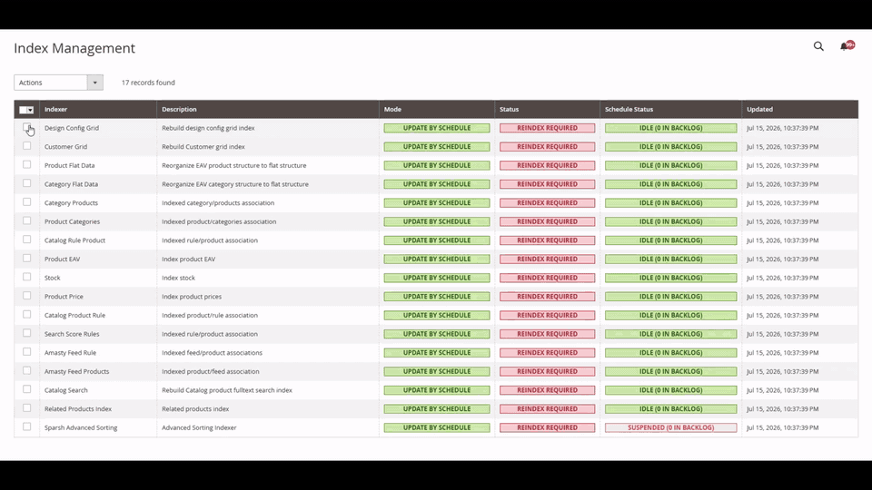
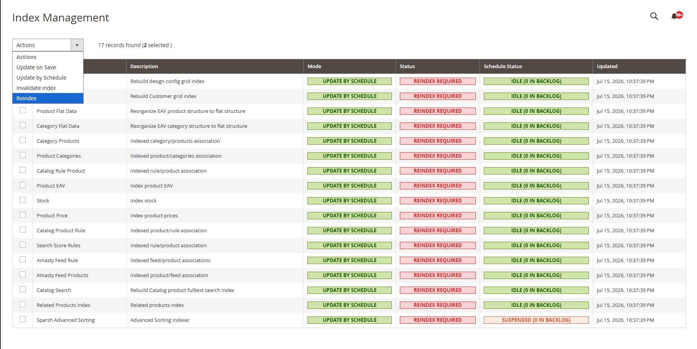

<p align="center">
  <a href="https://haroone.com/">
    
  </a>
</p>

<h1 align="center">Admin Reindex for Magento 2</h1>

<p align="center">
  Run selected Magento indexers from the native Index Management grid, in the background, with live progress.
</p>

<p align="center">
  An open-source Magento extension by <a href="https://haroone.com/">Haroone Agency</a>.
</p>

<p align="center">
  <a href="https://github.com/haroonsulahri/magento2-admin-reindex/actions/workflows/ci.yml"></a>
  <a href="LICENSE"></a>
</p>

<p align="center">
  <a href="#installation">Install</a> ·
  <a href="#run-a-reindex">Run a reindex</a> ·
  <a href="#permissions">Permissions</a> ·
  <a href="#support-and-magento-services">Support</a>
</p>

## Demo

<p align="center">
  
</p>

The popup opens immediately while Magento's native message queue begins processing the selected indexers in the background.

## Run a reindex

1. Open **System > Tools > Index Management**.
2. Select one or more indexers, or use Magento's **Select All** control.
3. Choose **Reindex** from the existing **Actions** dropdown and confirm.
4. Watch successful, running, skipped, failed, and remaining indexers in the progress popup.
5. Leave the page safely, or close the completed popup to refresh the grid statuses and timestamps.

<p align="center">
  
</p>

The admin request only schedules the work. Magento's message queue executes each selected indexer in the background, so closing the popup or leaving Index Management does not stop the job.

## Why use it?

Magento provides the indexer commands on the server, but it does not provide a native admin action for running selected indexers. This extension adds that missing action without replacing the core grid or building a separate admin page.

- Adds **Reindex** to Magento's existing Index Management action list
- Opens progress immediately without waiting for a full reindex request
- Continues processing after the administrator leaves the page
- Shows live totals and clear per-indexer results
- Uses Magento Bulk Operations, Message Queue, ACL, locking, cron runner, and indexer APIs
- Skips an indexer when Magento already reports it as working
- Logs complete exceptions while showing safe messages in the admin
- Adds no custom database tables, custom cron job, configuration page, or frontend code

## Requirements

| Magento release | Supported PHP versions | CI test version |
| --- | --- | --- |
| 2.4.4 | 8.1 | 2.4.4-p18 / PHP 8.1 |
| 2.4.5 | 8.1 | 2.4.5-p17 / PHP 8.1 |
| 2.4.6 | 8.1, 8.2 | 2.4.6-p15 / PHP 8.2 |
| 2.4.7 | 8.2, 8.3 | 2.4.7-p10 / PHP 8.3 |
| 2.4.8 | 8.3, 8.4 | 2.4.8-p5 / PHP 8.4 |
| 2.4.9 | 8.4, 8.5 | 2.4.9 / PHP 8.5 |

The module supports Magento Open Source and Adobe Commerce. The compatibility matrix follows Adobe's published [system requirements](https://experienceleague.adobe.com/en/docs/commerce-operations/installation-guide/system-requirements) and [released versions](https://experienceleague.adobe.com/en/docs/commerce-operations/release/versions).

## Installation

### Composer

Install the stable release from Packagist:

```bash
composer require haroone/module-admin-reindex:^1.0
php bin/magento module:enable Haroone_AdminReindex
php bin/magento setup:upgrade
php bin/magento setup:di:compile
php bin/magento cache:clean
```

Do not skip `setup:upgrade`. Magento registers the module's MySQL queue destination during recurring setup; without it, jobs can appear as scheduled but never start.

### Manual installation

Copy the repository contents to:

```text
app/code/Haroone/AdminReindex
```

Then run:

```bash
php bin/magento module:enable Haroone_AdminReindex
php bin/magento setup:upgrade
php bin/magento setup:di:compile
php bin/magento cache:clean
```

Run `php bin/magento setup:static-content:deploy -f` as part of the normal deployment flow when the store is in production mode. The progress popup includes small admin JavaScript and CSS files.

## Queue requirement

Magento's `consumers` cron group must be running. A normal Magento cron installation includes the core consumer runner. A dedicated process manager can run the module consumer instead:

```bash
php bin/magento queue:consumers:start haroone.adminreindex.indexer
```

If no consumer is running, the job remains queued and the popup shows that it is waiting. The extension deliberately does not start operating-system processes from an admin request.

## Behavior and scope

Each selection runs the full `reindexAll()` operation for that indexer. It does not reindex a specific database table, product, category, or row.

The extension does not change:

- Indexer modes
- PHP memory or execution time limits
- Magento cache state
- Store configuration

Magento's existing yellow **One or more indexers are invalid** notification already tells administrators when reindexing is required. This extension reuses that core behavior instead of adding a competing notification system.

## Core Magento features reused

- Index Management grid and Select All
- `IndexerRegistry` and indexer working state
- Native Bulk Operations persistence and history
- Message Queue and the Magento consumer cron group
- Magento Lock Manager for sequential module jobs
- Invalid-indexer system notification
- Admin modal, translations, and non-JavaScript form fallback

Administrators with Magento's **Bulk Actions** permission can also see jobs in the native Bulk Actions history and system-message area.

## Permissions

The extension adds **Reindex Data** beneath **Index Management** in Magento ACL. Grant it under **System > Permissions > User Roles > Role Resources**.

Users without this permission cannot schedule jobs, request progress, or see the **Reindex** action. Progress data is restricted to the admin user who created the bulk job.

## Failure handling

- An indexer already marked as working is skipped.
- One failed indexer does not prevent later queued indexers from running.
- The popup exposes only safe summaries.
- Full exceptions are written to Magento logs with the indexer ID.
- A global Magento lock keeps module-created reindex operations sequential, even with multiple consumer processes.

## Security

- POST-only scheduling endpoint with Magento form-key validation
- GET-only progress endpoint
- Dedicated ACL permission on both endpoints
- Strict indexer ID and bulk UUID validation
- Bulk-job ownership validation
- Escaped PHP output and result text inserted through jQuery text nodes

Please report security issues privately through [Haroone Agency contact](https://haroone.com/contact) instead of opening a public issue.

## Support and Magento services

This extension is built and maintained by [Haroone Agency](https://haroone.com/), a Magento-focused ecommerce engineering company working on custom modules, checkout fixes, migrations, performance, and production support.

- Product bugs and feature requests: [GitHub Issues](https://github.com/haroonsulahri/magento2-admin-reindex/issues)
- Magento engineering: [Haroone Magento services](https://haroone.com/services/magento)
- Private support and project enquiries: [Contact Haroone Agency](https://haroone.com/contact)

## License

Released under the [MIT License](LICENSE). Copyright © 2026 Haroone.com.
